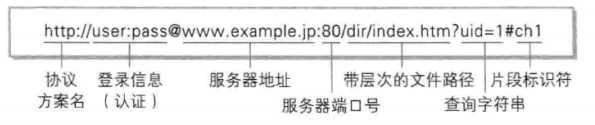
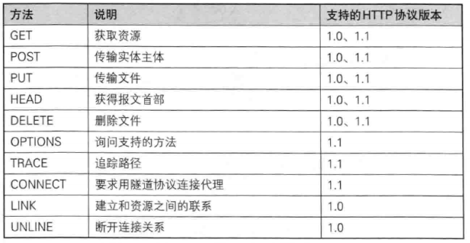
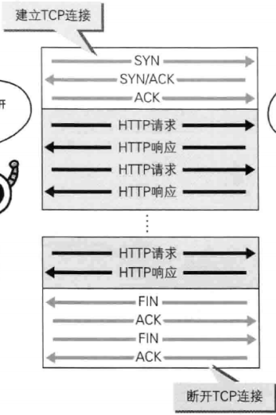

《图解HTTP [（日）上野宣著]》

## 1. 网络基础
> HTTP HyperText Transfer Protocol 超文本传输协议。
>
> 完成客户端到服务端等一系列运作流程。
> 
> HTTP协议是Web的基础。
> 
### 1.1 HTTP历史
1. 1989年3月 CERN 欧洲核子研究组织 Tim Berners-Lee 为知识共享，建立WWW World Wide Web万维网 （WWW是Web浏览器当年的名称）
> 3项WWW构建技术
> 1. HTML HyperText Markup Language 超文本标记语言(是一种SGML Standard Generalized Markup Language 标准通用标记语言)
> 
> 2. HTTP HyperText Transfer Protocol 超文本传输协议
> 
> 3. URL Uniform Resource Locator 统一资源定位符
2. 1990年11月 CERN 发布第一个Web服务器和浏览器
3. 1992年9月 日本第一个网站上线
4. 1995年 微软发布IE1.0 2.0
5. 1996年5月 HTTP1.0发布
6. **1997年1月 HTTP1.1发布 最主流**
7. 2004年 Mozilla发布Firefox

### 1.2 TCP/IP协议族
> TCP/IP协议族 按层次分为4层(分层解耦) 应用层、传输层、网络层和数据链路层
1. 应用层
   - 决定了向用户提供应用服务时通信的活动
   - 如FTP、DNS、HTTP
2. 传输层
   - 对上层应用层，提供处于网络连接中的两台计算机之间的数据传输
   - TCP Transmission Control Protocol 传输控制协议
   - UDP User Datagram Protocol 用户数据报协议
3. 网络层
   - 处理在网络上流动的数据包（是网络传输的最小数据单位）
   - 选择一条传输路线
   - 如 IP协议 Internet Protocol
4. 数据链路层
   - 处理连接网络的硬件部分
   - 包括控制操作系统、硬件设备驱动、网卡（NIC Network Interface Card）等
### 1.3 IP协议
> 把各种数据包传送给对方
> 
> 满足IP地址和MAC地址等条件
> 
> IP地址指明了节点被分配到的地址
> 
> MAC地址是指网卡所属的固定地址
> 
> IP地址可以和MAC地址进行配对, IP地址可变换, MAC地址基本上不会更改
> 
### 1.4 ARP协议
> IP间的通信依赖MAC地址。
> 
> ARP（Address Resolution Protocol）协议根据通信方的IP地址就可以反查出对应的MAC地址。
> 
> 路由选择, 在达到通信目标前的中转过程中，计算机和路由器灯网络设备只能获取粗略的传输路线。
### 1.5 TCP协议
> 提供可靠的字节流服务，将大块数据分割成报文段(segment)为单位的数据包进行管理。
>
> 能够确认数据最终是否送达到对方，使用**三次握手策略**（three-way handshaking），还有其他手段来保证通信的可靠。
>
> - 使用了TCP的标志，SYN（synchronize）和ACK（acknowledgement）
> - 发送端发送一个带SYN标志 的数据包
> - 接收端收到后回传一个带SYN/ACK标志的数据包，表明传达确认信息
> - 最后发送端再回传一个带ACK标志的数据包，握手结束
> - 任意阶段中断，TCP协议会再次以相同的顺序发送相同的数据包

### 1.6 DNS服务

> 提供域名到IP地址之间的解析服务。域名更易记忆。

### 1.7 URL和URI

> URL Unirse Resource Locator 统一资源定位符 目的是定位资源，一定能访问，就是网页地址。
>
> URI Uniform Resource Identifier 统一资源标识符 
> - 字符串标识的某一互联网资源，
> - 目的是标识资源，不一定能访问，
> - 包含URL和URN，URL是URI的子集
> - 分为绝对URI和相对URI
> - 
>
## 2. HTTP协议
> 客户端发出请求
> 
> 服务端响应请求

- HTTP是无状态协议，不持久化发送过的请求和响应，目的是为了更快地处理大量事物，确保协议的可伸缩性
- 引入Cookie技术，保持请求的状态，如保存用户信息

### 2.1 URI定位资源

- 方式1

> GET URI HTTP/1.1

- 方式2

> GET 相对URI HTTP/1.1
>
> Host: 域名

- 方式3 对服务器发起预检请求

> OPTIONS * HTTP/1.1

### 2.2 HTTP方法

1. GET 

> 获取资源

2. POST

> 传输实体主体，向服务器提交数据

3. PUT

> 一般用于传输文件

4. HEAD

> 获取报文首部信息

5. DELETE

> 删除文件

6. OPTIONS

> 询问支持的方法
>
> 查询针对请求URI指定的资源支持的方法

7. TRACE

> 追踪路径
>
> Max-Forwards，每经过一个服务器，-1，为0时的服务器直接返回200
>
> 容易引发XST跨站追踪攻击，不常用

8. CONNECT

> 要求用隧道协议连接代理
>
> 使用SSL（Secure Sockets Layer安全套接层）和TLS（Transport Layer Security传输层安全）协议把通信内容加密后经网络隧道传输

### 2.3 持久连接

> 以前每请求一次资源，都需要建立和断开连接，增加了通信量的开销。
>
> 为此提出了持久连接（HTTP Persistent Connections 或 HTTP keep-alive或HTTP connection reuse）的方法
>
> 只要任意一端没有提出断开连接，则保持TCP连接状态，期间可以进行多次请求和响应。
>
> - HTTP1.1默认都是持久连接

- 持久连接使得多个请求以管线化pipelining方式发送，并行发送多个请求，不用等待上一个请求的响应，速度更快。

### 2.4 Cookie状态管理

> 通过在请求和响应报文中写入Cookie信息来控制客户端的状态。
>
> - 服务端 Set-Cookie的首部字段，通知客户端保存Cookie
> - 下次请求时，客户端自动在报文中加入Cookie值
> - 服务端接收Cookie，与服务器的记录进行匹配，得到相关状态信息

## 3. HTTP报文

